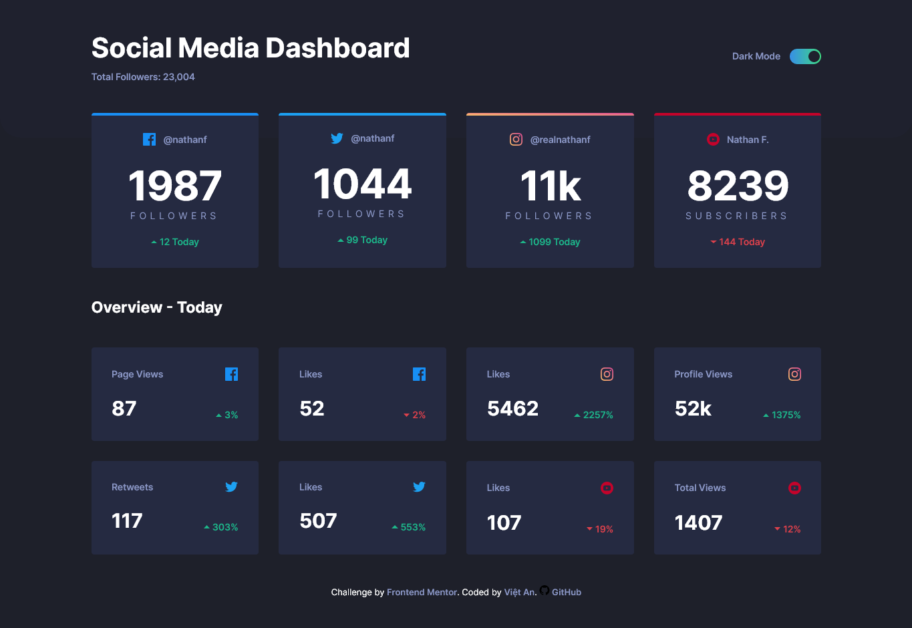
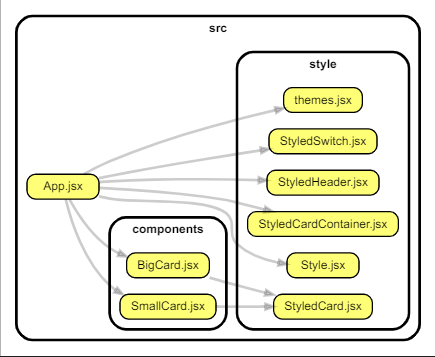

# Frontend Mentor - Social media dashboard with theme switcher solution

This is a solution to the [Social media dashboard with theme switcher challenge on Frontend Mentor](https://www.frontendmentor.io/challenges/social-media-dashboard-with-theme-switcher-6oY8ozp_H). Frontend Mentor challenges help you improve your coding skills by building realistic projects.

## Table of contents

- [Overview](#overview)
  - [The challenge](#the-challenge)
  - [Screenshot](#screenshot)
  - [Links](#links)
- [My process](#my-process)
  - [Built with](#built-with)
  - [What I learned](#what-i-learned)
  - [Useful resources](#useful-resources)
- [Author](#author)

## Overview

### The challenge

Users should be able to:

- View the optimal layout for the site depending on their device's screen size
- See hover states for all interactive elements on the page
- Toggle color theme to their preference

### Screenshot



### Links

- [Solution Page on Frontend Mentor](https://www.frontendmentor.io/solutions/social-media-dashboard-with-theme-switcher-using-styledcomponents-wPJ9GV1LRj)
- [Live Website](https://fm-social-dashboard-theme-sc-vietan0.netlify.app/)

## My process

### Built with

- [React](https://reactjs.org/) - JS library
- [Styled Components](https://styled-components.com/) - For styles
- Semantic HTML5 markup
- CSS custom properties
- Flexbox
- CSS Grid

### What I learned

- Basic structure of using `styled-components` with React:
  ```jsx
  // App --> React Component --> Styled Component
  export function Card() {
    return (
      <StyledCard>
        <div className="card-top"></div>
        /* more divs */
      </StyledCard>
    );
  }
  ```
  App structure:
  
  

### What I learned

- [Quick intro to styled-components (YouTube playlist)](https://www.youtube.com/playlist?list=PLC3y8-rFHvwgu-G08-7ovbN9EyhF_cltM)
## Author

- Frontend Mentor - [@vietan0](https://www.frontendmentor.io/profile/vietan0)
- Linkedin - [@vietan](https://www.linkedin.com/in/vietan/)
